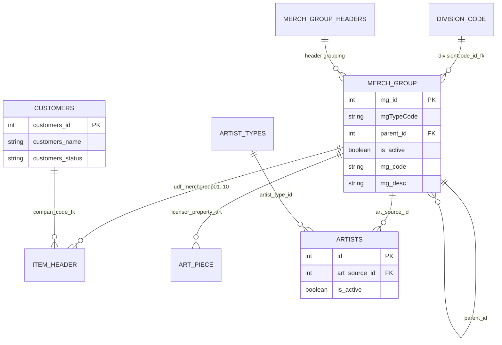
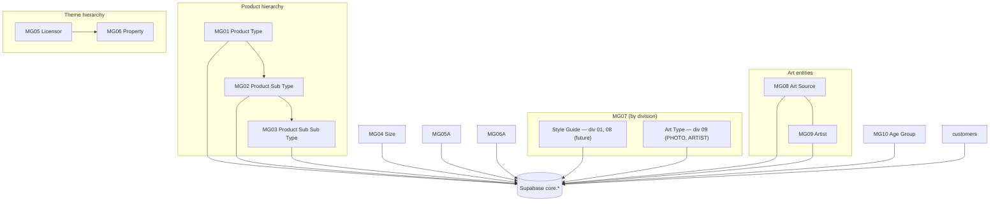

# DesignFlow → Supabase Master Data Migration

**Status:** **Phase A complete** — analysis & planning only; **no schema or data changes have been made.** Ready for Phase B (preview DDL).

**Last updated:** 2026-07-01 (MG05/MG06 division labels + MG07 semantics)

This document is the working plan for migrating DesignFlow PLM master data (primarily `designflow.merchGroup` and `designflow.customers`) into the shared Supabase project used by DAM, CRM, PM/PIM, and PLM.

Companion docs:

- [Shared database vision](../shared-database-vision.md)
- [Unified schema map](../unified-supabase-schema-map.md)
- [PLM master-data API verification](../verification/plm-master-data-api-20260624.md)
- [Schema implementation notes](../implementation/schema-implementation-notes.md)

---

## 1. Purpose

DesignFlow (ColdLion / PLM) stores most reference master data in a single polymorphic table, `designflow.merchGroup`, discriminated by merchandise-group type codes MG01–MG10. Customers live in `designflow.customers`.

The shared Supabase database (`popdam` / project ref `qsllyeztdwjgirsysgai`) already has:

- A **partial** customer + licensor + property import path via the read-only DesignFlow API (`tools/sync-plm-master-data.mjs` → `plm.import_master_data()`).
- Empty canonical taxonomy tables for product type/subtype (`core.product_type`, `core.product_subtype`).
- No rows yet in `core.merch_group`, `plm.reference_value`, or new art/age tables.

This migration completes the master-data picture so all four apps can reference **one canonical identity layer** with stable `designflow_plm` source refs — the same pattern already used for customers and licensors.

---

## 2. Analysis scope & sources

| Source | What was inspected | Result |
|---|---|---|
| Supabase MCP (`qsllyeztdwjgirsysgai`, project name `popdam`) | All app schemas, table columns, row counts | Complete for Supabase |
| `popcre/designflow-item-master` (GitHub) | Sequelize models, `item_library.service.js`, associations | Complete |
| `popcre/designflow-backend` (GitHub) | `customers`, `merchGroup`, `getMerchGroup`, `getCustomers`, RFQ guards | Complete |
| `u2giants/shared-db` | Existing migrations, import functions, schema conventions | Complete |
| Cloud SQL `designflow.merchGroup` | Column types, nullability, defaults (owner `information_schema` export) | **Schema confirmed** — see §3.1.1 |
| Cloud SQL `designflow.divisionCode` | Active divisions | **Complete** — see §3.1.3 |
| Cloud SQL `designflow.merchGroup` | Division-scoped MG07/MG09/MG10 counts | **Complete** — see §3.1.3, §3.6–3.7 |
| Cloud SQL `designflow.customers` | Row counts | **Complete** — 55 rows (matches PLM API sync); column-level export optional for audit |
| DesignFlow API (live) | Response shape vs DB | Partial — documented in [plm-master-data-api-20260624.md](../verification/plm-master-data-api-20260624.md) |

---

## 3. DesignFlow data model

### 3.1 `designflow.merchGroup`

**All MG01–MG10 master data lives in this single table.** There are no separate per-MG tables in Cloud SQL for product types, licensors, artists, etc. — only `mgTypeCode` distinguishes entity kind. Human-readable labels (Product Type, Licensor, …) are **not stored** in the database; they are business conventions mapped to `'01'`–`'10'` (see §3.2).

**Primary key:** `mg_id` (integer, NOT NULL)

**Discriminator:** `mgTypeCode` — varchar storing **`'01'` … `'10'`** (not the literal `MG01` prefix). Application code filters on `mgTypeCode`, e.g. licensors use `'05'`, properties use `'06'`.

**Indexes (from Sequelize):** PK on `mg_id` only. Expect application queries on `(mgTypeCode)`, `(parent_id)`, `(divisionCode_id_fk, mgTypeCode)`, `(is_active)`.

**Related table:** `designflow.merchGroupHeaders` — groups merch rows under division/company headers (`mgTypeCode`, `mgTypeDesc`). Used by `getMerchGroup` API; links `divisionCode` → `merchGroupHeaders` → `merchGroup`.

#### 3.1.1 Cloud SQL schema (confirmed 2026-07-01)

Source: owner-provided `information_schema.columns` export from Cloud SQL (`designflow` schema).

| Column | PostgreSQL type | Nullable | Default | Role |
|---|---|---|---|---|
| `mg_id` | `integer` | NO | — | Surrogate PK; referenced by `itemHeader`, `artPiece`, `artists`, RFQ rows |
| `mg_code` | `varchar` | YES | — | Business / item-number code (style-number generation) |
| `mg_desc` | `varchar` | YES | — | Display label (`title` in API export) |
| `ItemNoCode` | `varchar` | YES | — | Item-number segment code |
| `mgTypeCode` | `varchar` | YES | — | Entity type discriminator (`'01'`–`'10'`) |
| `createdTime` | `varchar` | YES | — | Audit string (not a timestamp type) |
| `createdUser` | `varchar` | YES | — | Audit string |
| `modTime` | `varchar` | YES | — | Audit string |
| `modUser` | `varchar` | YES | — | Audit string |
| `companyCode_fk` | `varchar` | YES | — | Company code string |
| `divisionCode_fk` | `varchar` | YES | — | Division code string |
| `divisionCode_id_fk` | `integer` | YES | — | Division scope — see §3.1.3 (codes **01**, **08**, **09**) |
| `companyCode_id_fk` | `integer` | YES | — | Company id ref |
| `is_active` | `boolean` | YES | **`false`** | Soft-active flag — DB default is inactive |
| `parent_id` | `integer` | YES | — | Self-reference to `mg_id` (**no DB-enforced FK** in Sequelize) |
| `mgCode2` | `varchar` | YES | — | Secondary code |
| `mgCategory` | `varchar` | YES | — | Category label |

**Migration implication of `is_active` default `false`:** The column default is inactive, but **`is_active` is not a reliable “in use” signal for every MG type.** Owner confirmed MG04 (Size) and MG05 (Licensor) rows are referenced on live items even when `is_active = false` — those types are imported in full regardless of flag (§9). For all other MG types, default import filter is `is_active IS TRUE`. Preserve the source flag in Supabase: `is_active = true` → `status = 'active'`; `false` or `NULL` → `status = 'inactive'`.

**Canonical export query** (use for full migration dump):

```sql
SELECT mg_id, mg_code, mg_desc, "ItemNoCode", "mgTypeCode",
       "createdTime", "createdUser", "modTime", "modUser",
       "companyCode_fk", "divisionCode_fk", "divisionCode_id_fk",
       "companyCode_id_fk", is_active, parent_id, "mgCode2", "mgCategory"
FROM designflow."merchGroup";
```

Note: quoted identifiers match PostgreSQL case for mixed-case column names (`"mgTypeCode"`, `"ItemNoCode"`, etc.).

#### 3.1.2 Row-level analysis (Cloud SQL, 2026-07-01)

**Table totals:** `designflow."merchGroup"` = **3,645 rows** (all **three active divisions** — see §3.1.3); **`designflow.customers`** = **55 rows** (matches existing `plm.customer_import` / API sync count).

**Scope:** Only `mgTypeCode` `'01'`–`'10'` (MG01–MG10) are in migration scope. **50 rows** use other codes and are **excluded** from import.

##### Counts per MG type (MG01–MG10 only)

| MG | `mgTypeCode` | Entity | Total | `active_true` | `active_false` | `active_null` |
|---|---|---|---:|---:|---:|---:|
| MG01 | `01` | Product Type | 152 | 58 | 94 | 0 |
| MG02 | `02` | Product Sub Type | 518 | 317 | 201 | 0 |
| MG03 | `03` | Product Sub Sub Type | 1,137 | 803 | 334 | 0 |
| MG04 | `04` | Size | 661 | 3 | 658 | 0 |
| MG05 | `05` | Licensor / Big Theme (div-dependent) | 82 | 2 | 80 | 0 |
| MG06 | `06` | Property / Little Theme (div-dependent) | 614 | 519 | 95 | 0 |
| MG07 | `07` | Style Guide / Art Type (division-dependent) | 81 | 2 | 79 | 0 |
| MG08 | `08` | Art Source | 32 | 9 | 23 | 0 |
| MG09 | `09` | Artist | 280 | 201 | 79 | 0 |
| MG10 | `10` | Age Group | 38 | 9 | 29 | 0 |
| | | **MG01–MG10 subtotal** | **3,595** | **1,923** | **1,672** | **0** |

**Observations:**

- **`active_null` is zero** for every type — every row has an explicit boolean.
- **MG04 and MG05 are almost all `is_active = false`** (658/661 sizes, 80/82 licensors) yet owner confirms both are **still referenced on live items** — import **all rows** for these types (§9).
- **MG07 (`mgTypeCode = '07'`):** Same MG slot, **different business meaning by division** (§3.5):
  - Divisions **01**, **08** → **Style Guide** — **no data yet** (future).
  - Division **09** → **Art Type** — **2 active rows** today: PHOTO (`PH`), ARTIST (`AR`).
- **MG09 (Artist):** **201 active** rows spanning divisions **01, 08, 09** (§3.6).
- **MG10 (Age Group):** **9 active** rows — same 3 labels (INFANT, JUVENILE, ADULT) repeated per division (§3.7).

##### Parent integrity (orphans / wrong parent)

| Child type | Orphan count | Owner decision |
|---|---:|---|
| MG02 (`02`) | 54 | All are `is_active = false` — **skip on import** (safe to ignore) |
| MG03 (`03`) | 1 | **Exclude from import** |
| MG07 (`07`) | — | Style Guide (div **01**, **08**): no data — skip. Art Type (div **09**): import 2 active rows |

##### Excluded `mgTypeCode` values (not MG01–MG10)

| `mgTypeCode` | Count | Action |
|---|---:|---|
| `11` | 10 | Exclude from migration |
| `12` | 13 | Exclude |
| `13` | 6 | Exclude |
| `14` | 7 | Exclude |
| `15` | 9 | Exclude |
| `18` | 2 | Exclude |
| `105` | 1 | Exclude |
| `109` | 1 | Exclude |
| `E` | 1 | Exclude |
| | **50** | **Do not import** |

Validation SQL (for re-run):

```sql
-- Counts per MG type + active breakdown
SELECT "mgTypeCode",
       COUNT(*) AS total,
       COUNT(*) FILTER (WHERE is_active IS TRUE) AS active_true,
       COUNT(*) FILTER (WHERE is_active IS FALSE) AS active_false,
       COUNT(*) FILTER (WHERE is_active IS NULL) AS active_null
FROM designflow."merchGroup"
WHERE "mgTypeCode" IN ('01','02','03','04','05','06','07','08','09','10')
GROUP BY "mgTypeCode"
ORDER BY "mgTypeCode";

-- Parent orphans (MG07 excluded — hierarchy TBD)
SELECT child."mgTypeCode", COUNT(*)
FROM designflow."merchGroup" child
LEFT JOIN designflow."merchGroup" parent ON parent.mg_id = child.parent_id
WHERE child.parent_id IS NOT NULL
  AND child."mgTypeCode" IN ('02','03','06')
  AND (
    parent.mg_id IS NULL
    OR (child."mgTypeCode" = '02' AND parent."mgTypeCode" <> '01')
    OR (child."mgTypeCode" = '03' AND parent."mgTypeCode" <> '02')
    OR (child."mgTypeCode" = '06' AND parent."mgTypeCode" <> '05')
  )
GROUP BY child."mgTypeCode";

-- Unexpected types (exclude from import)
SELECT "mgTypeCode", COUNT(*)
FROM designflow."merchGroup"
WHERE "mgTypeCode" IS NULL
   OR "mgTypeCode" NOT IN ('01','02','03','04','05','06','07','08','09','10')
GROUP BY "mgTypeCode"
ORDER BY "mgTypeCode";
```

##### Expected import volume (per §9 policy)

| Component | Rows |
|---|---:|
| MG01, MG02, MG03, MG06, MG07, MG08, MG09, MG10 where `is_active IS TRUE` | 1,918 |
| Less: MG03 orphan (1 row, **exclude**) | −1 |
| MG04 — **all rows** | 661 |
| MG05 — **all rows** | 82 |
| **Total merchGroup import** | **2,660** |
| Excluded: non-MG01–MG10 codes | 50 (not imported) |
| Excluded: MG02 inactive orphans | 54 (already outside active set) |
| Excluded: MG03 orphan | 1 |

#### 3.1.3 Division codes (`designflow."divisionCode"`)

All **3,645** `merchGroup` rows span the three active divisions below (`company_name_fk = EDGEHOME` for all). Many MG types are **duplicated per division** with the same `mg_code`/`mg_desc` pattern but different `divisionCode_id_fk`.

**Division code convention:** Documentation and upstream integrations use **`01`, `08`, `09`** as the canonical division codes. Cloud SQL stores these as integer FKs on `merchGroup.divisionCode_id_fk` (`1`, `8`, `9`) — **do not remap**; preserve the source integer in import/metadata and expose **`01`/`08`/`09`** in API layers via zero-padded mapping:

| Doc / source code | DB `divCode_id` / `divisionCode_id_fk` | `divisionCode_fk` |
|---|---:|---|
| **01** | 1 | CW001 |
| **08** | 8 | SP001 |
| **09** | 9 | EH001 |

**Active divisions** (`is_divcode_active = true`):

| Code | Owner label | `divCode_code` | `division_name` | `external_divisoncode` |
|---|---|---|---|---|
| **01** | Pop Lic | Lic | POP Lic | CW001 |
| **08** | Spruce Lic | Spruce Lic | Spruce Lic | SP001 |
| **09** | Spruce Non-Lic | Spruce non-Lic | Spruce non-Lic | EH001 |

**Division-scoped MG types (owner-confirmed):**

| MG | Scope | Active import count | Notes |
|---|---|---:|---|
| MG05 | Div **01**, **08**: **Licensor** — Div **09**: **Big Theme** | (see §3.1.2) | Import **all rows** (§9) |
| MG06 | Div **01**, **08**: **Property** — Div **09**: **Little Theme** | (see §3.1.2) | `is_active IS TRUE` + parent MG05 |
| MG07 **Style Guide** | Divisions **01**, **08** | 0 | **Future** — no rows to import yet |
| MG07 **Art Type** | Division **09** only | 2 | PHOTO (`PH`), ARTIST (`AR`) |
| MG09 Artist | Divisions **01**, **08**, **09** | 201 | Same artist names repeated per division |
| MG10 Age Group | Divisions **01**, **08**, **09** | 9 | 3 labels × 3 divisions: INFANT, JUVENILE, ADULT |
| MG01–MG06, MG08 | All divisions | (see §3.1.2) | Row totals include all three divisions |

**MG07 active rows — Art Type, division 09 only:**

| `mg_id` | `mg_code` | `mg_desc` | `divisionCode_id_fk` | Code | `divisionCode_fk` |
|---:|---|---|---:|---|---|
| 3787 | PH | PHOTO | 9 | **09** | EH001 |
| 3786 | AR | ARTIST | 9 | **09** | EH001 |

**MG10 active rows (3 per division):**

| Code | `divisionCode_id_fk` | `mg_id`s (descending) | Labels |
|---|---:|---|---|
| **09** | 9 | 3810, 3809, 3808 | INFANT, JUVENILE, ADULT |
| **08** | 8 | 3785, 3784, 3783 | INFANT, JUVENILE, ADULT |
| **01** | 1 | 3762, 3761, 3760 | INFANT, JUVENILE, ADULT |

**Supabase implication:** Store raw `divisionCode_id_fk` (1/8/9) plus canonical code (`01`/`08`/`09`) and `divisionCode_fk` in metadata. Picker APIs filter by division code. Unique constraints on `code` alone are **insufficient** — prefer `(division_code, code)`.

```sql
-- Re-run: active divisions
SELECT * FROM designflow."divisionCode" WHERE is_divcode_active = true;

-- Re-run: MG07 by division
SELECT mg_id, mg_code, mg_desc, "divisionCode_id_fk", "divisionCode_fk"
FROM designflow."merchGroup"
WHERE "mgTypeCode" = '07' AND is_active = true
ORDER BY mg_id DESC;

-- Re-run: per-type counts by division
SELECT "mgTypeCode", "divisionCode_id_fk", COUNT(*) AS total,
       COUNT(*) FILTER (WHERE is_active IS TRUE) AS active_true
FROM designflow."merchGroup"
WHERE "mgTypeCode" IN ('01','02','03','04','05','06','07','08','09','10')
GROUP BY "mgTypeCode", "divisionCode_id_fk"
ORDER BY "mgTypeCode", "divisionCode_id_fk";
```

### 3.2 MG code → business entity

**Owner-confirmed mapping** (business names are **not stored** in the database — only `mgTypeCode` `'01'`–`'10'`. Labels below are division-dependent where noted):

| MG label | `mgTypeCode` | Business entity | Parent rule |
|---|---|---|---|
| MG01 | `01` | Product Type | Root of product hierarchy |
| MG02 | `02` | Product Sub Type | `parent_id` → MG01 row |
| MG03 | `03` | Product Sub Sub Type | `parent_id` → MG02 row |
| MG04 | `04` | Size | **No parent** (independent) |
| MG05 | `05` | **Division-dependent** — see §3.5 | Root of theme hierarchy |
| MG06 | `06` | **Division-dependent** — see §3.5 | `parent_id` → MG05 row |
| MG07 | `07` | **Style Guide** (div **01**, **08**) / **Art Type** (div **09**) | See §3.5 |
| MG08 | `08` | Art Source | Independent list |
| MG09 | `09` | Artist | Divisions **01**, **08**, **09** — see §3.6 |
| MG10 | `10` | Age Group | Divisions **01**, **08**, **09** — see §3.7 |

**MG05 / MG06 use one `mgTypeCode` each with division-dependent business labels** (same pattern as MG07):

| Division code | MG05 label | MG06 label |
|---|---|---|
| **01** (Pop Lic) | **Licensor** | **Property** |
| **08** (Spruce Lic) | **Licensor** | **Property** |
| **09** (Spruce Non-Lic) | **Big Theme** | **Little Theme** |

Store `metadata.mg05_role` / `metadata.mg06_role` (or equivalent display label) on import so Supabase APIs can show the correct term per division.

### 3.3 Product hierarchy (MG01 → MG02 → MG03)

```
mgTypeCode '01'  (Product Type)
   └── parent_id
          mgTypeCode '02'  (Product Sub Type)
                 └── parent_id
                        mgTypeCode '03'  (Product Sub Sub Type)
```

**Application usage:**

- `itemHeader` columns `udf_merchgroup01_id` … `udf_merchgroup03_id` FK → `merchGroup.mg_id`
- RFQ copy guard (`rfqCopyMerchGroupGuard.js`) requires MG01–MG03 ids to exist and `is_active === true`
- Item library grid maps: Material → MG01, Construction → MG02, Treatment → MG03

### 3.4 Size (MG04)

Independent `merchGroup` rows (`mgTypeCode = '04'`). Referenced on items via `udf_merchgroup04_id`. No parent/child.

Cloud SQL: **661 rows**, only **3** with `is_active = true`, but owner confirms sizes are actively used — **import all 661 rows** (§9).

### 3.5 Theme hierarchy (MG05 → MG06) and MG07 (division-dependent)

**MG05 / MG06 — same `mgTypeCode`, label depends on division:**

| Division | MG05 (`mgTypeCode = '05'`) | MG06 (`mgTypeCode = '06'`) | Relationship |
|---|---|---|---|
| **01**, **08** | **Licensor** | **Property** | MG06 `parent_id` → MG05 |
| **09** (Spruce Non-Lic) | **Big Theme** | **Little Theme** | MG06 `parent_id` → MG05 |

> **Owner-confirmed:** Big Theme / Little Theme apply to division **09** only (Spruce Non-Lic, `divCode_id = 9`, EH001). Divisions **01** and **08** use Licensor / Property for the same `mgTypeCode` values.

```
Divisions 01 / 08:
  mgTypeCode '05'  (Licensor)
     └── parent_id ← mgTypeCode '06'  (Property)

Division 09:
  mgTypeCode '05'  (Big Theme)
     └── parent_id ← mgTypeCode '06'  (Little Theme)
```

**Validated in code** (`item_library.service.js` → `getLicensorsWithProperties`) — uses **Licensor / Property** wording; applies to licensed divisions. Non-lic division **09** rows use **Big Theme / Little Theme** in business UI but share the same `mgTypeCode` and `parent_id` structure.

1. Load properties where `mgTypeCode = '06'` and `is_active = true` (optional division filter).
2. Collect distinct `parent_id` values → parent MG05 `mg_id`s (Licensor or Big Theme).
3. Load parents where `mgTypeCode = '05'` and `mg_id IN (...)`.
4. Nest MG06 children under MG05 parents.

MG05 is **not** filtered by `is_active` in that API (only MG06 children are). Cloud SQL shows **80 of 82** MG05 rows with `is_active = false` — owner requires **full MG05 import** anyway (§9).

**MG07** (separate from MG05/MG06 theme hierarchy):

| Division code | MG07 business label | Data today | Import |
|---|---|---|---|
| **01** (Pop Lic) | **Style Guide** | None | **Skip** — future |
| **08** (Spruce Lic) | **Style Guide** | None | **Skip** — future |
| **09** (Spruce Non-Lic) | **Art Type** | PHOTO (`PH`), ARTIST (`AR`) | Import **2 active rows** |

MG07 is **not** part of the licensors API. Style Guide rows (divisions **01**, **08**) will be added later; only division **09** Art Type data exists in Cloud SQL today. Do not conflate Style Guide taxonomy with `dam.style_guide_file` (DAM file storage).

### 3.6 Art Source ↔ Artist (MG08 ↔ MG09)

**Canonical source for migration:** `merchGroup` rows — **not** the separate Sequelize `artists` table (use merchGroup MG09 as source of truth).

| MG | Cloud SQL (active) | Division scope |
|---|---:|---|
| MG08 Art Source | 9 | All divisions (§3.1.2) |
| MG09 Artist | **201** | **Divisions 01, 08, 09** — same artist codes/names repeated per `divisionCode_fk` |

**MG07 note:** Sequelize `ArtTypes.js` exists in codebase; live data is in `merchGroup` MG07. Only **Art Type** rows (division **09**) import today. **Style Guide** (divisions **01**, **08**) is future.

**Relationship type:** Many artists → one art source (one-to-many) where MG08/MG09 are used on items via `itemHeader.udf_merchgroup08_fk_id` / `udf_merchgroup09_fk_id`.

### 3.7 Age Group (MG10)

**Canonical source for migration:** `merchGroup` MG10 rows — **not** the separate Sequelize `age_group` table.

| Metric | Value |
|---|---:|
| Active rows | **9** |
| Divisions | **01**, **08**, **09** (Pop Lic, Spruce Lic, Spruce Non-Lic) |
| Labels per division | INFANT (`NF`), JUVENILE (`JV`), ADULT (`AD`) — 3 × 3 = 9 |

Used on `itemHeader` / `artPiece`. Store `divisionCode_id_fk` in metadata; unique key should include division (§3.1.3).

### 3.8 `designflow.customers`

| Column | Notes |
|---|---|
| `customers_id` | PK (integer identity) |
| `customers_name` | Display name |
| `customers_email`, `customers_phonenum` | Contact |
| `customers_code` | Business code |
| `customers_logo` | Logo URL (feeds `plm.customer_import.logo_url` in Supabase) |
| `customers_status` | String; API uses `'ACTIVE'` filter |
| `customers_passw` | Must **never** be imported (stripped in existing sync) |
| Airbyte columns | `customers_airbyte_*` — lineage only |

No `is_active` column on customers — activity is via `customers_status`.

**Cloud SQL row count (2026-07-01):** **55 rows** total — matches existing `plm.customer_import` / DesignFlow API sync (`customers_status = 'ACTIVE'`). Full column schema export still optional for audit columns.

## 4. DesignFlow API vs database

### 4.1 Customers — `GET /api/core/customers/getCustomers`

| Aspect | Behavior |
|---|---|
| Route | `customer-core.router.js` → `customer.controller.getCustomers` → `customer.service.getCustomers` |
| Query | `SELECT * FROM customers WHERE customers_status = 'ACTIVE' ORDER BY customers_name ASC` |
| Transforms | None (raw Sequelize rows, including password field) |
| Joins | None |
| vs DB | **Direct table read** with single filter |

**Implication for migration:** Import active customers only unless a separate full export is needed. Existing `plm.import_master_data()` already maps `customers_status = 'ACTIVE'` → `app.entity_status = 'active'`.

### 4.2 Licensors/properties — `GET /api/item_master/lib/getLicensorsWithProperties`

| Aspect | Behavior |
|---|---|
| Query | `merchGroup` only — properties (`mgTypeCode='06'`, `is_active=true`), then parent licensors (`mgTypeCode='05'`) |
| Transforms | Maps to `{ id, title, mg_code, parent_id, divisionCode, mgCode2, mgCategory, properties: [...] }` |
| Joins | Logical parent/child via `parent_id`, not SQL join |
| vs DB | **Subset** of merchGroup; excludes licensors without active properties; excludes MG07/MG01–04/etc. |

**Implication:** Full master-data migration **must use database export**, not API-only sync, for MG01–04, MG07–10, inactive rows, and orphan licensors.

---

## 5. Current Supabase architecture

**Project:** `qsllyeztdwjgirsysgai` (Supabase name: `popdam`)

### 5.1 Schema purposes

| Schema | Purpose |
|---|---|
| `app` | Auth profiles, roles, comments, activity, generic files |
| `core` | **Canonical shared business identities** (customer, contact, licensor, property, factory, product taxonomy) |
| `dam` | DAM assets, style groups, style guide **files** (operational), queues |
| `crm` | CRM-only workflow (opportunities, email triage, etc.) |
| `pim` | PM products, projects, workflow |
| `plm` | PLM operational tables + **source-shaped import staging** (`*_import`) |
| `ingest` | Raw snapshots, sync runs, dedupe candidates |
| `api` | Browser-facing views/RPCs |
| `public` | Legacy PopDAM tables (parallel taxonomy: `product_types`, `licensors`, …) |

### 5.2 Conventions (from existing migrations)

- **PKs:** `uuid` with `gen_random_uuid()` in Supabase; DesignFlow integer ids preserved in `*_source_ref` / `source_id` text columns.
- **Status:** `app.entity_status` enum (`active` / `inactive`) on core entities.
- **Audit:** `created_at`, `updated_at` timestamptz + `app.set_updated_at()` trigger.
- **Lineage:** `core.company_source_ref`, `core.taxonomy_source_ref` with `unique (source_system, source_table, source_id)`.
- **Staging:** `plm.customer_import`, `plm.licensor_import`, `plm.property_import` retain PLM-shaped rows + `raw jsonb`.
- **Soft delete:** `status` / `is_active` flags — no hard `deleted_at` on core taxonomy.
- **RLS:** Enabled on domain tables; master data is mostly read-heavy for authenticated apps.

### 5.3 Existing master-data row counts (production, 2026-07-01)

| Table | Rows | Notes |
|---|---|---|
| `core.customer` | 139 | Mix of CRM + PLM sources |
| `plm.customer_import` | 55 | PLM API customers |
| `core.licensor` | 20 | Includes non-PLM DAM rows |
| `plm.licensor_import` | 37 | PLM API |
| `core.property` | 256 | Includes DAM rows |
| `plm.property_import` | 468 | PLM API |
| `core.product_type` / `product_subtype` | 0 | **Awaiting migration** |
| `core.merch_group` | 0 | Generic MG tree unused so far |
| `plm.reference_value` | 0 | Generic reference spine unused |
| `public.product_types` | ~500 | PopDAM legacy — **do not conflate with PLM MG01** without reconciliation |

---

## 6. Entity relationship summary (DesignFlow)



---

## 7. Proposed Supabase schema design

### 7.1 Schema placement (with justification)

| Entity | MG | Target | Rationale |
|---|---|---|---|
| Customer | — | `core.customer` | **Decided.** Already live; CRM/PM/PLM share hub. |
| Art Source | MG08 | **`core.art_source`** (new) | Cross-app reference; user mandate; used by PM art workflow and PLM items. |
| Artist | MG09 | **`core.artist`** (new) | Cross-app; FK to `core.art_source`; mirrors normalized `artists` table. |
| Age Group | MG10 | **`core.age_group`** (new) | Cross-app pickers on items/art; mirrors normalized `age_group` table. |
| Product Type | MG01 | **`core.product_type`** | Table exists; `dam.asset` / `pim.product` already FK here. |
| Product Sub Type | MG02 | **`core.product_subtype`** | Table exists; parent `product_type_id`. |
| Product Sub Sub Type | MG03 | **`core.product_subsubtype`** (new) | **No third level today** — required for MG03 hierarchy. |
| Size | MG04 | **`core.product_size`** (new) | Independent shared picker; used on every item/SKU context. Prefer `core` over `plm` because DAM/PM will need sizes without PLM operational coupling. |
| Licensor / Big Theme | MG05 | **`core.licensor`** | All divisions; `metadata.division_code` + display label (Licensor vs Big Theme) |
| Property / Little Theme | MG06 | **`core.property`** | All divisions; `licensor_id` FK; label Property vs Little Theme in metadata |
| Style Guide (MG07, div 01/08) | MG07 | **`core.style_guide_type`** (new, future) | Taxonomy for Style Guide — **no import yet**; not `dam.style_guide_file` |
| Art Type (MG07, div 09) | MG07 | **`core.art_type`** (new) | Art Type taxonomy — PHOTO, ARTIST today |

**Also add (pattern consistency):**

| Artifact | Purpose |
|---|---|
| `plm.merch_group_import` | Source-shaped MG rows (like `licensor_import`) |
| `plm.art_source_import`, `plm.artist_import`, `plm.age_group_import`, `plm.product_size_import`, `plm.art_type_import` | Optional per-entity staging |
| `core.taxonomy_source_ref` | Lineage for all MG rows (`source_system='designflow_plm'`, `source_table='merchGroup'`, `source_id=mg_id`) |
| `ingest.raw_record` | Full JSON snapshot per imported row |

**Do not put everything in `core.merch_group`:** That table exists as a generic MG tree but the shared schema already split licensors/properties and product taxonomy into typed tables. Typed tables give clearer FKs for DAM/PM (`product_type_id`, `licensor_id`, etc.) and match the long-term vision in [unified-supabase-schema-map.md](../unified-supabase-schema-map.md).

**Do not use `plm.reference_value` as primary** for MG01–07: It lacks relational FKs for hierarchies (parent product type → subtype → subsubtype; licensor → property). Keep `plm.reference_value` for minor operational codes (season, UDF, etc.).

### 7.2 Proposed new tables (column sketch)

#### `core.product_subsubtype`

- `id uuid PK`
- `product_subtype_id uuid FK → core.product_subtype(id) ON DELETE CASCADE`
- `name text NOT NULL`, `code text`
- `status app.entity_status DEFAULT 'active'`
- `metadata jsonb` — store `mgCode2`, `mgCategory`, `ItemNoCode`, `divisionCode_id_fk`
- `unique nulls not distinct (product_subtype_id, code)`

#### `core.product_size`

- `id uuid PK`
- `name text NOT NULL`, `code text`
- `status app.entity_status`
- `metadata jsonb` — include `division_code_id`; unique on `(division_code_id, code)` not `code` alone

#### `core.art_type` (MG07 — Art Type, division **09** only today)

- `id uuid PK`
- `name text NOT NULL`, `code text`
- `status app.entity_status`
- `metadata jsonb` — `division_code` (`09`), `division_code_id_fk` (9), `mg07_role = 'art_type'`

#### `core.style_guide_type` (MG07 — Style Guide, divisions **01** / **08**, future)

- Same column sketch as `core.art_type`
- `metadata.mg07_role = 'style_guide'`
- **No rows imported in Phase C** — placeholder table for when division **01** / **08** data arrives

#### `core.art_source` (MG08)

- `id uuid PK`
- `name text NOT NULL`, `code text`
- `status app.entity_status`
- `metadata jsonb`

#### `core.artist` (MG09)

- `id uuid PK`
- `art_source_id uuid FK → core.art_source(id) ON DELETE SET NULL`
- `name text NOT NULL`
- `email text`
- `status app.entity_status`
- `metadata jsonb` — `artist_type_id` lineage if needed

#### `core.age_group` (MG10)

- `id uuid PK`
- `name text NOT NULL`
- `status app.entity_status`
- `metadata jsonb`

Extend existing `core.product_type` / `core.product_subtype` with optional `status app.entity_status` if not already present (additive).

---

## 8. Data mapping (DesignFlow → Supabase)

| DesignFlow source | Filter | Supabase target | Source ref |
|---|---|---|---|
| `merchGroup` where `mgTypeCode='01'` | `is_active IS TRUE` | `core.product_type` | `taxonomy_source_ref` → entity `product_type` |
| `merchGroup` where `mgTypeCode='02'` | `is_active IS TRUE` + valid `parent_id` → MG01; skip 54 inactive orphans | `core.product_subtype` | FK `product_type_id` resolved via source ref |
| `merchGroup` where `mgTypeCode='03'` | `is_active IS TRUE` + valid `parent_id` → MG02; **exclude 1 orphan** | `core.product_subsubtype` | FK `product_subtype_id` resolved via source ref |
| `merchGroup` where `mgTypeCode='04'` | **All rows** (661) — regardless of `is_active` | `core.product_size` | taxonomy source ref |
| `merchGroup` where `mgTypeCode='05'` | **All rows** (82) — Licensor (div **01**/**08**) or Big Theme (div **09**) | `core.licensor` | `metadata.mg05_label` per division |
| `merchGroup` where `mgTypeCode='06'` | `is_active IS TRUE` + parent MG05 | `core.property` | `licensor_id` via parent; Property vs Little Theme in metadata |
| `merchGroup` where `mgTypeCode='07'` AND `divisionCode_id_fk = 9` | `is_active IS TRUE` (2 Art Type rows) | `core.art_type` | `metadata.mg07_role = 'art_type'`, division **09** |
| `merchGroup` where `mgTypeCode='07'` AND `divisionCode_id_fk IN (1, 8)` | **Skip** — Style Guide future | `core.style_guide_type` (later) | No data today |
| `merchGroup` where `mgTypeCode='08'` | `is_active IS TRUE` | `core.art_source` | taxonomy source ref |
| `merchGroup` where `mgTypeCode='09'` | `is_active IS TRUE` (201 rows; div **01**/**08**/**09**) | `core.artist` | `metadata.division_code` required |
| `merchGroup` where `mgTypeCode='10'` | `is_active IS TRUE` (9 rows; div **01**/**08**/**09**) | `core.age_group` | `metadata.division_code` required |
| `merchGroup` other codes (`11`, `12`, …, `E`) | **Exclude** (50 rows) | — | — |
| `customers` | `customers_status='ACTIVE'` (55 rows; match API) | `core.customer` + `plm.customer_import` | existing `company_source_ref` (`source_table='customers'`) |

**Field mapping (merchGroup → core):**

| merchGroup | Supabase |
|---|---|
| `mg_id` | `source_id` in `taxonomy_source_ref` |
| `mg_desc` | `name` |
| `mg_code` / `mgCode2` | `code` (+ metadata) |
| `is_active` | `status` = `active` / `inactive` |
| `parent_id` | Resolved to UUID FK via source-ref lookup |
| `divisionCode_id_fk` | `metadata.division_code_id_fk` (raw 1/8/9) + `metadata.division_code` (`01`/`08`/`09`) + `metadata.division_code_fk` |
| full row | `plm.merch_group_import.raw` + `ingest.raw_record` |

---

## 9. Import filter & active-record policy

### Owner-confirmed import rules (2026-07-01)

| Rule | Applies to |
|---|---|
| **`mgTypeCode IN ('01'…'10')` only** | All types — exclude 50 rows with codes `11`, `12`, `13`, `14`, `15`, `18`, `105`, `109`, `E` |
| **`is_active IS TRUE`** | MG01, MG02, MG03, MG06, MG07, MG08, MG09, MG10 (default) |
| **Import all rows regardless of `is_active`** | **MG04 (Size)** and **MG05** (Licensor / Big Theme) — referenced on live items despite `is_active = false` |
| **Skip inactive orphans** | MG02 — 54 rows with wrong/missing MG01 parent and `is_active = false` |
| **Exclude** | MG03 — 1 orphan row |
| **Division filter on import** | MG07 Art Type: division **09** only (2 rows); MG07 Style Guide (**01**/**08**): skip; MG09/MG10: all divisions |
| **MG07 role metadata** | Set `mg07_role = 'art_type'` (div **09**) or `'style_guide'` (div **01**/**08**, future) |

**Supabase `status` mapping (all imported rows):** preserve source flag — `is_active = true` → `active`; `false` → `inactive`. MG04/MG05 rows imported with `is_active = false` land as **`inactive` in Supabase** but remain available for item FK resolution and pickers that include inactive master data.

### Application code expectations (for comparison)

| MG | `is_active` usage in DesignFlow code |
|---|---|
| MG01–MG03 | **Required true** for RFQ copy (`is_active === true` strictly) |
| MG05 | **Not** filtered in licensors API — aligns with full MG05 import; label Licensor (div **01**/**08**) or Big Theme (div **09**) |
| MG06 | Filtered `is_active: true` in `getLicensorsWithProperties`; label Property (div **01**/**08**) or Little Theme (div **09**) |
| MG04 | Almost all rows `is_active = false` in DB but still on items — **full import** overrides flag filter |

### Customers

Use `customers_status = 'ACTIVE'` — **55 rows** in Cloud SQL (matches API).

---

## 10. Migration order (dependency-safe)

1. **Preview branch DDL** — new tables + indexes + `taxonomy_source_ref` entity types (additive only).
2. **MG01 Product Types** — no parent dependency.
3. **MG02 Product Sub Types** — requires MG01 source-ref map.
4. **MG03 Product Sub Sub Types** — requires MG02 map.
5. **MG04 Sizes** — independent.
6. **MG05 Licensors** — extend/reconcile existing `core.licensor` + import rows (do not duplicate PLM API rows).
7. **MG06 Properties** — requires licensor UUID map.
8. **MG07 Art Types** — import 2 division-**09** rows to `core.art_type`; Style Guide (**01**/**08**) deferred.
9. **MG08 Art Sources** — independent.
10. **MG09 Artists** — requires art source map; reconcile with `artists` table if both exist.
11. **MG10 Age Groups** — independent; reconcile with `age_group` table.
12. **Customers** — extend existing import (full DB export, not API-only); fuzzy match via `core.match_customer` for CRM potentials.
13. **Post-import** — build `api.*` picker views; optional backfill links to `public.product_types` / DAM legacy.

---

## 11. Data transformation rules

| Topic | Rule |
|---|---|
| IDs | Generate new UUIDs; always insert `taxonomy_source_ref` / `company_source_ref` with `source_id = text(mg_id)` |
| Parent resolution | Build `Map<mg_id, uuid>` per entity type; skip MG02 inactive orphans (54); **exclude** MG03 orphan (1) |
| `is_active` mapping | Always preserve: `true` → `active`, `false`/`NULL` → `inactive` — even for MG04/MG05 full import |
| MG04 / MG05 | Import **all** rows; do not filter on `is_active` |
| Non-MG01–MG10 codes | Skip entirely (50 rows) |
| Division | Preserve `divisionCode_id_fk` + code **01**/**08**/**09**; set MG05/MG06 display labels per §3.5 |
| MG07 | Import Art Type (div **09**) only; Style Guide (div **01**/**08**) is future — same `mgTypeCode` `07` |
| MG07 / MG09 / MG10 source | **`merchGroup` only** — ignore separate Sequelize `art_types` / `artists` / `age_group` tables |
| Passwords | Strip `customers_passw` before any `ingest.raw_record` |
| PopDAM legacy | Do not auto-merge `public.product_types` with PLM MG01 — run reconciliation report first |
| Existing PLM API data | Upsert by source ref; update names/metadata in place |

---

## 12. Validation plan

| Check | Method |
|---|---|
| Row counts per MG type | DesignFlow §3.1.2–§3.1.3 vs Supabase after import (**2,660** MG rows + division metadata) |
| Division scoping | MG07 Art Type: 2 rows div **09**; Style Guide div **01**/**08**: none; MG09: 201; MG10: 9 |
| Active filter | MG04/MG05: all rows; others: `active_true` minus MG03 orphan; customers: 55 |
| Parent FK integrity | Zero orphan `product_subtype.product_type_id`, etc. |
| Source ref coverage | Every imported row has `taxonomy_source_ref` with `designflow_plm/merchGroup/{id}` |
| Duplicate detection | No duplicate `(source_system, source_table, source_id)` |
| API parity | `getCustomers` count ≈ `core` customers with PLM source ref; licensors/properties nested shape matches |
| Sample spot-check | 20 random items: MG01–06 ids resolve to same labels in Supabase |
| RFQ guard parity | MG01–MG03 imported active rows satisfy `isMerchGroupActive` |

---

## 13. Rollback strategy

1. **DDL rollback** — migration is additive; rollback = stop using new tables, not dropping (shared-db policy: expand, then contract).
2. **Data rollback** — delete rows by `ingest.sync_run.id` marker inserted per import batch.
3. **Source refs** — delete from `core.taxonomy_source_ref` / `company_source_ref` where `sync_run_id = ?` (add sync_run FK in import metadata).
4. **Apps** — continue reading DesignFlow until cutover flag flips; Supabase import is idempotent via source refs.

---

## 14. Application code impact (post-migration)

### DesignFlow / PLM repos (`popcre/designflow-*`)

| Area | Change |
|---|---|
| `item_library.service.js` | MG picker endpoints read Supabase or dual-read during cutover |
| `lib.model.js` `getMerchGroup` / `getMG` | Replace raw SQL/Sequelize with Supabase client or sync’d cache |
| `rfqCopyMerchGroupGuard.js` | Point lookups to `core.product_*` or stable API |
| `init-models.js` | Long-term: FK ints → UUID service calls (big bang deferred) |

### Shared DB (`u2giants/shared-db`)

| Area | Change |
|---|---|
| `supabase/migrations/` | New timestamped migrations per §7 |
| `plm.import_master_data()` | Extend or add `plm.import_merch_group_master(jsonb)` |
| `tools/sync-plm-master-data.mjs` | Add DB export path alongside API |
| `api.*` | Picker views: `api.pm_product_taxonomy`, `api.dam_mg_pickers`, etc. |

### Consumer apps (after sync to `shared-db/`)

| App | Impact |
|---|---|
| **PM/PIM** | Product boards, filters — use `core.product_*`, `core.licensor` |
| **DAM** | Master Data / style tracker (`search_style_tracker_link_candidates`) — extend candidate search to new tables |
| **CRM** | Customer pickers already on `api.crm_customer_*`; no MG direct impact |
| **PLM** | Item header MG FK columns remain ints until PLM DB cutover — needs mapping layer |

---

## 15. Risks

| Risk | Severity | Mitigation |
|---|---|---|
| MG04/MG05 mostly `is_active = false` | Medium | Full import per owner; preserve inactive status in Supabase |
| MG07 Style Guide vs Art Type | Low | Div **01**/**08** Style Guide: skip (future); div **09** Art Type: import 2 rows |
| Division-duplicated codes | Medium | Unique keys must include `division_code_id`; same `mg_code` exists per division |
| Unexpected `mgTypeCode` values (50 rows) | Low | Hard exclude list in import script |
| `mgTypeCode` vs `MG01` confusion | Medium | Import filters use `'01'`…`'10'` |
| Dual artist/age models | Low | **Resolved:** import from `merchGroup` MG09/MG10 only |
| MG07 Style Guide vs Art Type | Low | Same `mgTypeCode` `07`; route by division code **01**/**08** vs **09** |
| MG07 vs `dam.style_guide_file` | Medium | Style Guide taxonomy ≠ DAM file storage |
| PopDAM `public.product_types` (~500) vs PLM MG01 | High | Reconciliation / mapping report; do not blind merge |
| Partial licensor import (37 PLM vs 20 core) | Medium | Upsert by source ref; audit DAM-only licensors |
| `parent_id` not DB-enforced | Medium | Import-time validation + quarantine |
| Cross-app collision (one schema change in flight) | High | Follow [AGENTS.md](../../AGENTS.md) — preview first, one migration PR |

---

## 16. Assumptions

1. Cloud SQL schema `designflow."merchGroup"` matches owner export (§3.1.1) — **confirmed**.
2. All MG01–MG10 entities are rows in `merchGroup` only; `mgTypeCode` is the authoritative discriminator (not `mg_code` prefix or human-readable names).
3. **`is_active` default is `false`** — import filter is type-specific (§9); MG04 and MG05 import all rows.
4. **Three active divisions** — codes **01**, **08**, **09** (DB FKs 1, 8, 9); all 3,645 merchGroup rows span them (§3.1.3).
5. **MG05 / MG06 labels** — div **01**/**08**: Licensor / Property; div **09**: Big Theme / Little Theme (§3.5).
6. **MG07** — Style Guide (div **01**, **08**): future. Art Type (div **09**): 2 active rows.
7. MG09/MG10 canonical source is **`merchGroup`**, not separate Sequelize tables.
8. MG03 orphan (1 row) is **excluded** from import.
9. Integer `mg_id` remains stable — source-ref spine for future full PLM DB cutover.
10. Supabase project `qsllyeztdwjgirsysgai` is the correct target.
11. Migration is **additive**; no dropping `public.*` PopDAM tables in this phase.
12. **`designflow.customers`** = 55 rows — matches API-active scope.

---

## 17. Deferred decisions (Phase B+ — not blockers for this plan)

These do **not** block finalizing the analysis or starting Phase B. Resolve during DDL, import, or app integration:

1. **MG07 Style Guide (div 01/08)** — Parent FK and `core.style_guide_type` population when data arrives.
2. **PopDAM taxonomy** — Map or replace `public.product_types` (~500 rows) vs PLM MG01–03.
3. **Division-scoped Supabase API** — Confirm every picker filters by division code **01**/**08**/**09**.
4. **Per-division row counts (optional)** — Run §3.1.3 “counts by division” SQL for MG01–MG06 if you want import validation per division before Phase C.

---

## 18. Implementation plan (phased)

### Phase A — Analysis ✅ complete

All items below are done. This README is the signed-off planning baseline for Phase B.

- [x] Supabase schema inventory
- [x] Codebase model + API tracing
- [x] Cloud SQL `merchGroup` column schema (owner `information_schema` export)
- [x] MG01–MG10 business-entity mapping (owner confirmation)
- [x] Cloud SQL row counts + orphan report (§3.1.2)
- [x] Import filter policy — MG04/MG05 full import; MG02 inactive orphans skipped; MG03 orphan excluded
- [x] Division codes + MG07/MG09/MG10 division scoping (§3.1.3)
- [x] Canonical source: `merchGroup` for MG07/MG09/MG10 (not separate Sequelize tables)
- [x] MG05/MG06 division labels — Licensor/Property (**01**/**08**) vs Big Theme/Little Theme (**09**)
- [x] MG07 division semantics — Style Guide (**01**/**08**) vs Art Type (**09**)

### Phase B — DDL on preview (`xjcyeuvzkhtzsheknaiu`)

- [ ] Add `core.product_subsubtype`, `core.product_size`, `core.art_type`, `core.style_guide_type` (future), `core.art_source`, `core.artist`, `core.age_group`
- [ ] Add `plm.merch_group_import` + import function skeleton
- [ ] `scripts/check-sql.sh` + `supabase db push --dry-run`

### Phase C — Import rehearsal

- [ ] Export `designflow.merchGroup` + `customers` to JSON/CSV (service-role script, not browser)
- [ ] Import to preview; run validation SQL (§12)
- [ ] Owner sign-off on counts + sample labels

### Phase D — API & app integration

- [ ] `api.*` picker contracts
- [ ] Extend Master Data candidate search for new tables
- [ ] PM/DAM read paths against preview

### Phase E — Production promotion

- [ ] `shared-db` PR merged per [AGENTS.md](../../AGENTS.md) checklist
- [ ] `supabase db push` to `qsllyeztdwjgirsysgai` in approved window
- [ ] Re-run import; verify CRM/PM/DAM smoke tests

---

## 19. Testing strategy

1. **Static** — `scripts/check-sql.sh` on every migration file.
2. **Preview import** — full validation suite (§12) stored as repeatable SQL in `scripts/` or `docs/designflow-master-data-migration/validation/`.
3. **API contract tests** — compare DesignFlow API sample JSON to Supabase `api.*` views.
4. **Application smoke** — PM product board filters; DAM Master Data search; CRM customer list counts.
5. **Regression** — existing `plm.import_master_data()` still upserts 55/37/468 without duplicate source refs.
6. **RLS** — authenticated read smoke per app role; no service-role in browser.

---

## 20. Recommendations to improve design during migration

1. **Single discriminator in Supabase** — store `mg_type_code` in `metadata` on every taxonomy row for audit, even when typed tables exist.
2. **Unify artist/age** — deprecate duplicate MG08–10 merch rows; use `core.artist` / `core.age_group` only with source refs.
3. **Add `status` to product taxonomy tables** — align with `core.licensor.status` and RFQ `is_active` semantics.
4. **Quarantine table** — use `ingest.dedupe_candidate` for orphan MG rows instead of silent drop.
5. **Do not expand `core.merch_group` as primary API** — use typed tables for FK clarity.
6. **Reconcile PopDAM taxonomy deliberately** — one-time mapping table `ingest.legacy_taxonomy_map` before pointing DAM assets at PLM-backed `core.product_type`.

---

## 21. Dependency diagram (MG entities)



---

## 22. Document history

| Date | Change |
|---|---|
| 2026-07-01 | Owner confirmed division **09** (not 07) for Big Theme / Little Theme |
| 2026-07-01 | MG05/MG06 division labels: Licensor/Property (div **01**/**08**), Big Theme/Little Theme (div **09**) |
| 2026-07-01 | **Phase A finalized** — analysis complete; deferred items in §17 |
| 2026-07-01 | Row counts, import policy (**2,660**), MG03 orphan excluded, division scoping |
| 2026-07-01 | Cloud SQL `merchGroup` schema confirmed; MG01–MG10 mapping documented |
| 2026-07-01 | Initial analysis: codebase + Supabase complete |
