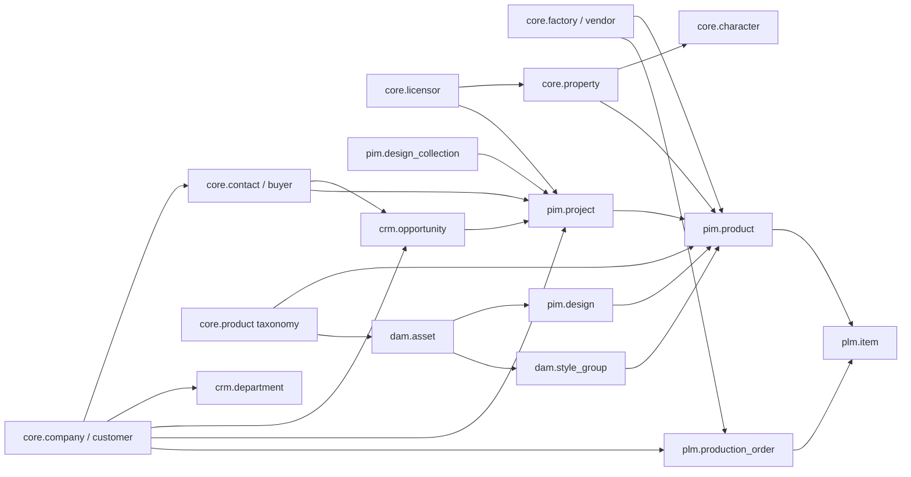

# Unified Supabase Relationship Map

Date: 2026-06-20

This document maps cross-domain relationships for the shared Supabase target `qsllyeztdwjgirsysgai`. It complements `docs/unified-supabase-schema-map.md`.

## Core Graph

## Key Join Strategy

Use source-reference tables instead of overwriting historical ids.

| Canonical object | Existing ids to preserve | Proposed source-ref key |
|---|---|---|
| Company/customer | Directus `retailer.id`, `ingested_domains.id`, PLM `customers_id`, PLM `externalCustomer`, DAM path `customer`/PO `customer_code` | `(source_system, source_table, source_id)` |
| Contact/buyer | Directus `buyer.id`, `ingested_contact.id`, CRM email/person ids if present | `(source_system, source_table, source_id)` |
| Licensor | DAM `licensors.id/external_id`, PM `licensor.id`, PLM `licenseList`/MG code | `(source_system, source_table, source_id, code)` |
| Property/character | DAM `properties/characters`, PM `property`, PLM `properties_and_characters`, association tables | `(source_system, parent_ref, code_or_name)` |
| Product/SKU/item | PM `product.id/code/external_id`, PLM `itemHeader.item_num_id`, DAM `style_groups.sku`, DAM `assets.sku`, ClickUp task id | `(source_system, source_table, source_id, sku)` |
| Factory/vendor | PM `factory.id`, PLM `Factory.id`, `vendor.vendor_id`, `externalVendor` | `(source_system, source_table, source_id)` |
| Production order | PM `order.order_number`, DAM `prod_order_headers_current.external_id`, PLM `ProdOrderHeader`/`ProdOrderDetail` keys | `(source_system, prod_order_number, line_ref)` |

## DAM To PM

| Relationship | Current signal | Target |
|---|---|---|
| Asset to design | PM `design.thumbnail_url/nas_path`; DAM `assets.relative_path`, `thumbnail_url`, `style_group_id` | `pim.design.primary_asset_id -> dam.asset.id`, plus `pim.design_asset` for many-to-many |
| Style group to product | DAM `style_groups.sku`; PM `product.code`; DAM `erp_items_current.style_number` | `dam.style_group.product_id -> pim.product.id` after SKU reconciliation |
| Asset taxonomy to product taxonomy | DAM `licensor_id`, `property_id`, `product_subtype_id`, `characters`; PM `licensor`, `property`, `product_type` | DAM FKs should point to shared `core` taxonomy rows |
| Style guide files used by SKU | DAM `sku_files_used.sku`, `style_guide_file_id` | `dam.sku_style_guide_source` can later point to `pim.product` or `plm.item` through `core.sku_ref` |
| Checkout/open file state | DAM `asset_checkouts`, `helper_devices`, `helper_tokens` | DAM-owned operational state; PM can read only derived availability if needed |

Realtime implications:

- DAM already uses realtime for scan/crawl/agent state.
- PM should subscribe to `pim.product`, workflow tables, and linking tables, not directly to DAM queues.
- When a DAM asset becomes linked to a PM design/product, emit changes through a stable `api.product_assets` view or RPC result rather than exposing queue tables.

## DAM To PLM

| Relationship | Current signal | Target |
|---|---|---|
| DAM ERP item to PLM item | DAM `erp_items_current.style_number`, `external_id`; PLM `itemHeader.item_num_id`, item number/style fields | `dam.erp_item_ref` or `plm.item_source_ref`, then link `dam.style_group` by SKU |
| DAM production PO to PLM production order | DAM `prod_order_headers_current.prod_order_number`, `style_number`; PLM `ProdOrderHeader`, `ProdOrderDetail` | `plm.production_order_line` canonical, DAM current table becomes ingest/cache |
| DAM taxonomy to PLM MG/licensing data | DAM `mg*_code`, `licensor_code`, `property_code`; PLM `merchGroup`, `licenseList`, property/character associations | Shared `core` taxonomy and `core.merch_group` |

Long-term, PopDAM should not maintain a separate production-order current table if PLM is available in the same Supabase project. Keep current/raw DAM tables for audit and cutover safety, then serve PO status from `plm` or `api`.

## PM To CRM

| Relationship | Current signal | Target |
|---|---|---|
| Opportunity to project | CRM `crm_opportunity.project`; PM `project.id` | `crm.opportunity.project_id -> pim.project.id` |
| Account pipeline to project/product | CRM `retailer/contact/department`; PM `project.retailer/buyer`, `product.retailer/buyer` | Shared `core.company/contact`, with CRM departments as optional account segmentation |
| Licensor approval | CRM `crm_licensor_approval_thread.property_name`; PM product submissions/revisions | Link to `core.property`, `pim.product_submission`, and `pim.revision_request` when a specific product/submission exists |
| Tasks and notes | CRM `crm_task`, `crm_note`; PM collaboration collections | Keep domain-owned tables, but share `app.comment`/`app.activity` pattern if a note/task needs polymorphic links |

Realtime implications:

- If CRM opportunity stage movement should trigger PM movement, use a database trigger or service-role Edge Function that writes to PM workflow tables.
- If PM product stage changes should affect CRM pipeline, write a small integration function against canonical ids; avoid frontend dual-writes.

## PM To PLM

| Relationship | Current signal | Target |
|---|---|---|
| Product to item master | PM `product.code`, ClickUp/import ids; PLM `itemHeader` item number/style fields | `pim.product.plm_item_id -> plm.item.id` after SKU matching |
| Order to production order | PM `order.order_number`; DAM/PLM production refs | `pim.order.production_order_id -> plm.production_order.id` or line id |
| Factory/vendor | PM `product.factory`; PLM `Factory/vendor` | PM should reference `core.factory`, which maps to PLM factories/vendors |
| Samples | PM `product_sample`; PLM sample tables absent on selected `main` | Keep PM samples in `pim.product_sample`; add PLM sample links only if sample models are merged to `main` |
| Licensing status | PM `product_submission`, `revision_request`; PLM `licensingStatus`, `licensingMilestone`, `LicenseFeedBacks` | Bridge by product/item and licensor/property; do not assume one-to-one status states |

## CRM To PLM

| Relationship | Current signal | Target |
|---|---|---|
| Company/customer | CRM `retailer/ingested_domains`; PLM `customers/externalCustomer`; DAM production PO customer fields | `core.company` with `core.company_source_ref` |
| Contact/buyer | CRM `buyer/ingested_contact`; PLM may not expose buyers as first-class in selected source | `core.contact`; PLM customer contact fields remain source refs if found later |
| Opportunity to production | CRM opportunity fields `production_po_number`, `sales_order_number`, `factory`, `project` | Link opportunities to `plm.production_order` and `pim.project` when numbers match |
| Factory/vendor | CRM `factory`; PLM `Factory/vendor` | `core.factory` canonical |

## App Support Relationships

| Concept | Current sources | Target |
|---|---|---|
| Comments | PM `directus_comments`; PLM `comments`; CRM notes; DAM no generic comments table | `app.comment` with typed entity links or domain-specific note tables |
| Files | PM `directus_files/product_file`; DAM `assets/style_guide_files`; PLM `itemAttachment/artPieceAttachment/itemLicenseImage`; Spaces URLs | `app.file_asset` only for generic uploads; keep DAM assets as first-class `dam.asset` |
| Activity/audit | PM `product_activity`, Directus activity if imported; PLM `AuditLog`, `email_logs`; DAM logs/queues | `app.activity` for cross-app user-visible events, domain logs stay local |
| Saved views/layouts | PM `pm_saved_view`, `pm_view_pref`; PLM `Grid*`, `viewlayout`; CRM frontend state | Keep separate by domain initially. Shared view system is a future product decision. |
| Notifications | PLM `user_notification`; future PM/CRM needs | `app.notification` with domain origin/source refs |

## Recommended API Layer

Expose frontend contracts through `api` views/RPCs after raw tables are in place:

| API contract | Backing data |
|---|---|
| `api.pm_product_board` | `pim.product`, `pim.stage`, `core.company/contact`, `core.licensor/property`, optional `dam.style_group` |
| `api.pm_product_assets` | `pim.product`, `pim.design`, `dam.asset`, `dam.style_group` |
| `api.crm_account_overview` | `core.company`, `core.contact`, `crm.department`, `crm.opportunity`, `pim.project`, `plm.production_order` |
| `api.dam_asset_library` | `dam.assets`, `dam.style_groups`, `core.taxonomy`, RLS-safe metadata |
| `api.plm_item_status` | `plm.item`, `plm.production_order`, `plm.licensing_status`, `core.taxonomy` |
| `api.global_search` | `core.company/contact`, `pim.product/project/design`, `crm.opportunity`, `dam.asset/style_group`, `plm.item/order` |

